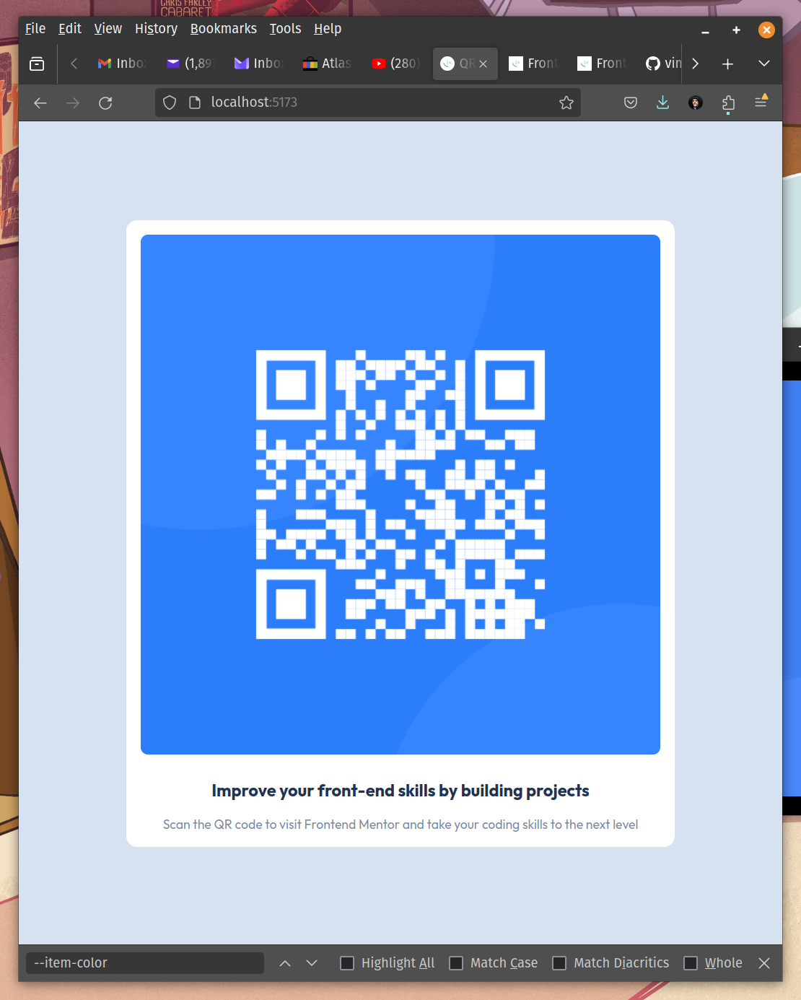

# Frontend Mentor - QR code component solution

This is a solution to the [QR code component challenge on Frontend Mentor](https://www.frontendmentor.io/challenges/qr-code-component-iux_sIO_H). Frontend Mentor challenges help you improve your coding skills by building realistic projects. 

## Table of contents

- [Overview](#overview)
  - [Screenshot](#screenshot)
  - [Links](#links)
- [My process](#my-process)
  - [Built with](#built-with)
  - [What I learned](#what-i-learned)
  - [Continued development](#continued-development)
  - [Useful resources](#useful-resources)
- [Author](#author)

**Note: Delete this note and update the table of contents based on what sections you keep.**

## Overview

### Screenshot

### Links

- Solution URL: [Github](https://github.com/jamesbarnett/qcm-fm)
- Live Site URL: [Github Page](https://jamesbarnett.github.io/qcm-fm/)

## My process

### Built with

- HTML5
- CSS custom properties
- CSS Grid

### What I learned

- CSS custom properties
- Vertical centering of elements
- Strategies for layout
- Font integration, google fonts

### Continued development

 - Improve my attention to detail when analyzing designs
 - Better understanding and more reps in general with grid and flex layout and alignment with appropriate responsiveness
 - Better feel for when "wrapper"/"container" divs/elements are necessary, appropriately convenient, or just gratuitous
 - More up to date with best practices and more refined taste for markup and CSS in general
 
### Useful resources

- [Kevin Powell's YouTube Channel](https://www.youtube.com/@KevinPowell) - Kevin's channel introduced me to Front End Mentor. It's been helpful to get my dated HTML and CSS knowledge updated.

## Author

- Frontend Mentor - [@jamesbarnett](https://www.frontendmentor.io/profile/jamesbarnett)
TryHackMe - [jamesb43](https://tryhackme.com/p/jamesb43)
